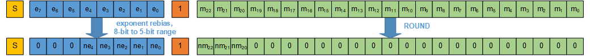

### Block Floating Point Quantization
Block floating point quantisation is numerical format that allows the majority of computations in a neural network to take place using integer maths for efficiency, while maintaining much of the automatic scaling ability of floating point arithmatic. It also provides significant reduction in storage and bandwidth requirements compared to normal floating point formats. As with other numerical formats employed in neural network accelerators, any deviation from full precision arithmetic comes at the risk of loss of network accuracy. One way to handle custom arithmetic is with [Quantization](Quantization.md). Another way is to model the custom arithmetic in training framework such as NNCF, and run a few re-training epochs to fine-tune the weights. This document describes addition of block floating point arithmetic to NNCF.

#### BFP Format Description
[Block floating point](https://en.wikipedia.org/wiki/Block_floating_point) performs floating point operations by:
1. Grouping nearby floating point values into fixed-size blocks. In this case, blocking is performed along the depth dimension of a tensor.
1. For each block:-
1.     Round each value to the required, non blocked precision. Different rounding mechanisms can be used - round towards zero (truncate), round to nearest, round to even etc.
1.     Choosing a common exponent for values within each block and re-aligning mantissas to match the new exponent. Rounding can be applied, with the c
1.     Performing integer arithmetic on mantissas of the blocked values, along with the one exponent calculation required for the block
1.     Converting result back to standard floating point format.
1. Accumulate results over the full calculation in fp32.

Step 3 above (performing integer arithmetic) usually consumes vast majority of compute resources, whereas all other steps can either be done once on host CPU attached to hardware accelerator (e.g. blocking of weights for a network only needs to be done once), or consume relatively small amount of processing. Using block floating point instead of regular floating point uses less resources but may cause accuracy degration due to effect of blocking.

Block floating point is usually combined with smaller mantissa sizes. For example, **int5bfp** block floating point format has:
- 5 integer bits (including 1 sign bit)
- 5 exponent bits
- block size 32
Without blocking, this would be comparable to **FP9** floating point format: 1 sign bit, 1 implicit mantissa bit, 3 explicit mantissa bits, 5 exponent bits. 

To be exact, an **int5bfp** value represented by integer bits  and common exponent  has value ^s%20*%202^{e_4e_3e_2e_1e_0%20-%20bias}%20*%20m_3m_2m_1m_0), where __bias__ is **FP16** exponent bias equal to 127.

To clarify naming, **FPX** refers to non-blocked representation, **intYfp** refers to blocked representation.

**Figure 1** shows conversion from **FP32** to **FP9** non-blocked floating point. Yellow __S__ is the sign bit, blue __e__ are the exponent bits, orange __1__ is the implicit 1 in [floating point representation](https://en.wikipedia.org/wiki/Single-precision_floating-point_format), and green __m__ are the mantissa bits. **FP32** has 8-bit exponent and 23-bit mantissa (not counting implicit 1). **FP9** has 5-bit exponent and 3-bit mantissa.

Above, mantissa bits are rounded from 23 to 3 bits. 


**Figure 2** shows blocking four **FP9** floating point values into a block of four **int5bfp** values. Now the sign bit and the possibly shifted mantissa bits comprise a signed 5-bit integer. Exponent is carried separately.


##### Additional properties of BFP
BFP with block size of 1 is a regular floating point format, since no exponent is shared.

BFP computation need not be symmetric. For example, network activations could be represented as **int5bfp** but network weights as **int4bfp**. Selection of appropriate BFP format depends on what the hardware supports and achieved accuracy of network of interest with selected precisions.


#### Example Hardware Support for BFP
An AI accelerator hardware usually but not always has the following main parts:
- Host CPU overseeing the acceleration
- Accelerator's external memory (e.g. DDR) for large off-chip storage
- On-chip cache
- Compute engine (usually performaning either matrix-matrix, vector-vector, or dot-product computations)
- auxiliary compute engine(s) for special functions

Each main part may hold data in different precisions. Here is one possible handling mechanism, separate for weights and activations. 

Weights are converted from **FP32** directly to **int4bfp** by the host CPU. They are then sent, to accelerator's external memory in blocked form. The accelerator simply reads already-blocked weights from external memory, possibly caching them, and feeds them into its main compute engine.

Activations are handled very differently. Host CPU may convert **FP32** input activations into blocked **FP16**. The accelerator reads blocked **FP16** values, down-converts them to **int5bfp**, computes dot products in its compute engine with **int4bfp** weights, producing non-blocked **FP16** results. These results go through **FP16** auxiliary compute engine (e.g. computing sigmoid()), and then blocked into **int5bfp** before being stored into on-chip cache for next layer processing.


#### BFP Handling in NNCF
To successfully train to BFP-enabled hardware, NNCF must model as close as possible target hardware's arithmetic. Current implementation models hardware as implemented in Intel FPGA Deep Learning Accelerator Suite, supported by the Intel OpenVINO™ toolkit. 

NNCF inserts a Quantization layer for each input of every convolution layer. This quantization layer performs converts to lower precision and blocks FP32 activations/weights, and then converts them back to FP32. The exact conversion mechanism is described in hardware models. Such models include number of integer and exponent bits, block size, and also exact rounding methods.

##### BFP configuration
There are many user-configurable parameters that control BFP support in NNCF. Retraining configuration file selects `hw_config_type` and `hw_config_subtype` to select a desired set of BFP parameters. For example,

```
    "model": "mobilenet_v2",
    "hw_config_type": "dla",
    "hw_config_subtype": "int5bfp",
    ...
    "compression": {
      "algorithm": "quantization",
      "name": "int5bfp_onnx"
    }
```

Selected `hw_config_subtype` corresponds to a file under `nncf/hw_configs`. It first defines in `config` section BFP formats. For example: 

```
    "quantization": {
        "int4bfp": {
            "mantissa_bits": 2,
            "exponent_bits": 5,
            "block_size": 32,
            "mode": "blockfp",
            "granularity": "perblock"
        },
        "int5bfp": {
            "mantissa_bits": 3,
            "exponent_bits": 5,
            "block_size": 32,
            "mode": "blockfp",
            "granularity": "perblock"
        },
        "fp16": {
            "mantissa_bits": 10,
            "exponent_bits": 5,
            "block_size": 1,
            "mode": "blockfp",
            "granularity": "perblock"
        }
    }
```

and then in `operations` section of the hw_config file defines how each compute operation in NNCF should have its inputs quantized:

```
    "operations": [
        {
            "type": "Convolution",
            "quantization": {
                "activations": "int5bfp",
                "weights": "int4bfp"
            }
        },
        {
            "type": "DepthWiseConvolution",
            "quantization": {
                "activations": "int5bfp",
                "weights": "int4bfp"
            }
        },
```
